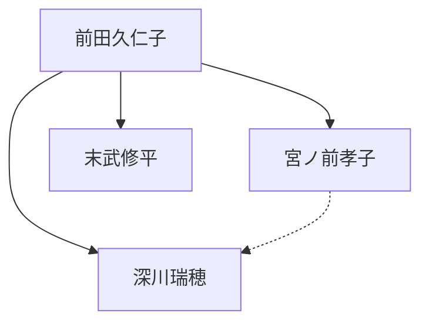

# 前田久仁子さんチームのメンバー情報

## コアメンバープロフィール

### 前田 久仁子（まえだ くにこ）

- **役割**: 事業オーナー
- **プロフィール**:
  - 自称「住所不定のポップなババア(51)」（Instagram プロフィールより）
  - 看護師歴 30 年、農業歴 20 年
  - 食・栄養や健康習慣に関わる事業歴 24 年
- **事業**:
  - 「ライフ」講座と「ひとラボ」コミュニティの運営責任者
  - FNeA 合同会社 代表
  - 「やさいろ」（食育・食農関連事業）代表
  - 「ANONE」（依存症予防の啓発プロジェクト）代表
- **専門性**:
  - 予防医療の専門家
  - ASK（アルコール薬物問題全国市民協会）認定の依存症予防教育アドバイザー
  - コミュニティーナース（フリー看護師）
- **主な役割**:
  - プロジェクト全体の方向性を決定
  - コンテンツ制作の中心的役割
  - コンサルティングセッションの実施（メイン講師）
- **ビジョン**:
  - 「一家に 1 人はライフを学んでほしい」という理念
  - 「予防可能な生きづらさと病気の連鎖の打破」を目指す
  - 「健康で楽しく生きる人間を増やす」ことが大きな目標

### 宮ノ前 孝子（みやのまえ たかこ）

- **役割**: サポーター
- **概要**:
  - 前田久仁子さんの妹
  - 副業として事業をサポート
  - コンサルティングのサブ講師
- **特記事項**:
  - ライフ講座とひとラボの両方で一部のコンサルを担当
  - オペレーション面での意思決定にも関与
  - 今後のサポーター拡大時の中心人物になる可能性
- **課題**:
  - コンサル日程調整の煩雑さに課題を感じている
  - 対応可能な時間が限られている
- **展望**:
  - 相談内容（色、習慣、運動など）に応じた担当者の分担と料金体系の検討

### 深川 瑞穂（ふかがわ みずほ）

- **役割**: 秘書担当
- **愛称**: ざわみ
- **概要**:
  - 久仁子さんの事業の秘書業務を担当
  - 会員管理や事務作業を主に担当
- **業務内容**:
  - 日常的な会員対応と管理
  - 決済管理や支払いリマインド
  - 銀行振込の会員への支払い通知
  - LINE やスプレッドシートでのコンサル日程調整
- **課題感**:
  - 支払いサイクルや日程が会員ごとに異なり、管理が煩雑
  - 会員数増加に伴うミス増加の懸念
- **Notion 関連**:
  - Notion の主要ユーザーとなる予定
  - 日々の業務フローの効率化に強い関心

## プロジェクト関係者

### 末武 修平（すえたけ しゅうへい）

- **役割**: 業務改善コンサルタント
- **概要**:
  - Notion システム構築を担当
  - 業務フロー改善のコンサルティング
- **担当業務**:
  - プロトタイプの開発・提案
  - トライアル期間中の実装担当
  - 長期的な業務効率化の提案
- **具体的な提案内容**:
  - スタッフ管理画面の最適化
  - 会員情報・決済管理の効率化
  - コンサル予約・管理システムの構築
  - 会員向けポータルサイトの設計
- **アプローチ**:
  - トライアル期間では基本的な機能に集中
  - 長期的には高度な自動化・連携を提案

## 事業とサービス概要

### ライフ講座

- **概要**: 思考の癖の書き換えに焦点を当てた 8 ヶ月間の集中講座
- **運営形態**:
  - 20 人定員で年 3 回開催（4 ヶ月ごとに募集）
  - 初期 4 回は無料のコンサルティングを含む
  - 5 回目以降は有料コンサルティング
- **特徴**:
  - 本質的な学びを提供
  - 講義は非常に濃密で、人生 100 年時代を生き抜く知恵を学ぶ

### ひとラボ（コミュニティ）

- **概要**: 月額制コミュニティサービス（月額 1,980 円、今後 3,000 円に値上げ予定）
- **提供内容**:
  - 月 1 回のセミナーとライブ配信
  - 不定期のオフライン交流会
  - 有料のコンサルティング（全て有料）
- **運営方法**:
  - インスタグラムの鍵アカウントと LINE のオープンチャットで運営
  - 「ライフ」講座への入り口としても機能

## チーム構造と意思決定フロー

- **最終決定者**: 前田久仁子さん
- **実務オペレーション**: 深川瑞穂さん（ざわみさん）
- **コンテンツ・セッション**: 前田久仁子さん、宮ノ前孝子さん
- **システム構築**: 末武修平

## 主な業務分担

| 業務内容       | 前田久仁子 | 宮ノ前孝子 | 深川瑞穂 | 末武修平 |
| -------------- | ---------- | ---------- | -------- | -------- |
| コンテンツ制作 | ◎          | ○          | -        | -        |
| コンサル実施   | ◎          | ○          | -        | -        |
| 会員管理       | -          | △          | ◎        | -        |
| 決済管理       | -          | -          | ◎        | -        |
| 日程調整       | -          | ○          | ◎        | -        |
| システム構築   | -          | -          | △        | ◎        |
| 業務改善       | △          | △          | ○        | ◎        |

_凡例: ◎ 主担当、○ 副担当、△ サポート、-関与なし_

## 業務上の主な課題

### コンサル日程調整の煩雑さ

- ライフのコンサル（初期 4 回無料、以降有料）と、ひとラボのコンサル（有料）が混在
- 宮ノ前氏、前田氏の対応可能な時間が限られており、調整が煩雑
- 現状は LINE やスプレッドシートで行われ、非効率

### 決済管理の課題

- 支払い期間（毎月、3 ヶ月、6 ヶ月、1 年など）や支払いタイミングが顧客ごとに異なる
- 会員数が増えると手動管理でのミスが増える懸念
- 銀行振込対応の効率化が必要

### 会員向けコンテンツ提供の課題

- ライフ会員専用、ひとラボ会員専用、両会員共通のコンテンツの管理
- 会員ステータス変更時の対応
- 講座期ごとのコンテンツ管理

## 今後の検討事項

- サポーター増加時の役割分担と権限設定
- 料金体系とコンサル担当者の関係
- ライフ/ひとラボそれぞれの講師担当制
- 業務フローの標準化
- 支払いサイクルの標準化（毎月、3 ヶ月、6 ヶ月、1 年に限定）
- 支払い日の集約（5 日、15 日、25 日など）
- サポーターの育成プログラムとビジネス支援

## 留意点

- コンサル日程調整が現状の主要な課題
- 支払い管理（特に銀行振込）の効率化が必要
- メンバー間でのタスク共有・進捗管理の仕組み構築
- 会員数増加に備えた運用体制の整備
